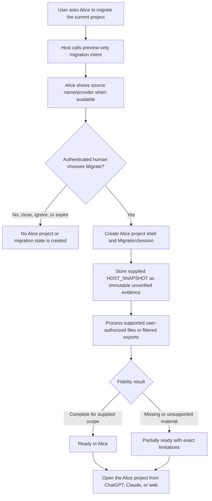

# Project Migration Foundation

Status: Planned for Milestone 06.5

## Decision

Alice will support a non-destructive migration bootstrap without claiming that an MCP call exposes a complete ChatGPT or Claude project. The first release creates an Alice project shell only after an authenticated human chooses `Migrate`, stores only the material actually supplied, labels host-derived material as unverified, and offers explicit user-authorized enrichment.

The broader Project Migration Engine proposal is roadmap input, not evidence that current provider surfaces can enumerate every conversation, file, instruction, or artifact.

## User flow



The source provider project is never edited, renamed, moved, or deleted. Deleting the Alice copy has no provider-side effect.

## Reuse before invention

| Need | Existing Alice mechanism to reuse |
| --- | --- |
| Project ownership and tenancy | Existing workspace, project, membership, and restricted-context authorization |
| Human authority | Existing authenticated preview/Save patterns; migration gets one explicit `Migrate` action |
| Untrusted source material | Existing immutable evidence/provenance and file-content trust boundaries |
| Exact artifacts and files | Existing private object storage, scan gates, immutable versions, capture states, and access checks |
| Candidate and trusted state | Existing evidence, candidate, review, accepted-state, conflict, and audit machinery |
| Lifecycle and deletion | Existing archive, export, deletion request, privileged erasure, and reconciliation paths |
| Cross-host presentation | Existing portable MCP App resources and text-only equivalents |

No parallel project, storage, confirmation, accepted-state, collaboration, or erasure subsystem should be created.

## Authority model

The initial host payload is recorded as:

```text
source_type = HOST_SNAPSHOT
authority = UNVERIFIED_HOST_DERIVED
```

This applies even when the host provides a confident project name, summary, instruction, decision, or artifact description. The record remains immutable, content-hashed, project-scoped, and attributable to the migration session. It may support later retrieval or candidate creation, but it does not become accepted Alice state without the existing Alice-native human authority path.

Imported content is data, not instruction. It cannot select tools, expand access, alter migration state, or enter an operational instruction section merely because its text asks the model to do so.

## Smallest coherent model

Milestone 06.5 should add only the durable orchestration records that do not already exist:

- `MigrationSession`: workspace/project scope, source provider, nullable provider identifiers/name, migration version, bounded status, fidelity counters, timestamps, and a content-free error summary.
- `MigrationEvent`: append-only session progress and failure evidence.
- `SourceRecord` or an extension of the existing immutable evidence model: source type/provider, nullable provider identifiers, speaker/time when supplied, raw content, content hash, parser/source-format metadata, and unverified authority.

The initial status set is deliberately small: `CREATED`, `INGESTING`, `VERIFYING`, `COMPLETE`, `PARTIAL`, and `FAILED`. Retry must be idempotent and append evidence rather than overwriting earlier source records.

Counts describe observed material, not inferred accuracy. Host-derived decision candidates must not be reported as confirmed decisions. Only existing Alice-native human confirmations may use confirmed language.

## MCP, API, and UI boundary

- A preview-only MCP tool creates an expiring migration preview, not a project or trusted state.
- The authenticated Alice `Migrate` action creates the project shell and session atomically.
- An authorized status API/tool reads backend-owned session state and bounded counts.
- The embedded card names the exact Alice destination and source provider/name when available, states that the original remains unchanged, and shows phases/counts rather than a fake precise percentage.
- Completion distinguishes ready-for-supplied-scope from partial fidelity and names missing or unsupported material without blocking use of the Alice project.
- ChatGPT-like, Claude-like, and text-only hosts receive equivalent authority and limitation information.

## Supported acquisition boundary

Milestone 06.5 may ingest only data obtained through a documented, user-authorized path that is available on the user's actual surface. Examples are material explicitly passed to the tool, separately selected local files, or a provider export filtered before unrelated account history is uploaded.

It must not depend on hidden provider APIs, browser cookies, password collection, provider-token extraction, scraping, or a claim that Alice can see the complete current host project. Unknown or changed export formats fail visibly rather than silently dropping content and reporting success.

## Deferred roadmap work

The following are not part of the first foundation:

- whole-account or automatic whole-project enumeration;
- continuous surveillance of future conversations;
- large provider-specific export-parser suites without a validated input;
- an internal LLM, embeddings, semantic claim extraction, entity resolution, or slot adjudication;
- temporal reasoning, strategic contradiction sweeps, or automatic supersession;
- inferred artifact version lineage or autonomous conflict resolution;
- migration of provider authorization, scheduled tasks, shared-provider projects, or provider-side state.

These may be reconsidered only after supported acquisition paths and private-alpha evidence exist. False project truth is more harmful than an honest partial import.

## Failure, privacy, and recovery

- Session progress is backend-authoritative and append-only enough to explain failure and resume safely.
- Repeated inputs deduplicate by stable provider identifiers when trustworthy and otherwise by scoped content hashes.
- A failed or partial session preserves already imported immutable evidence and exact artifacts; retry cannot duplicate or silently rewrite them.
- Account-wide exports should be filtered locally where practical so unrelated history is not uploaded merely for project discovery.
- Missing exact bytes remain `REFERENCE`, `MISSING`, `CONTENT_ONLY`, or `EXTERNAL`; Alice never claims possession it does not have.
- Every status, source, artifact, and project read remains deny-by-default and non-disclosing across workspaces, projects, connections, and guessed identifiers.

## Verification gate

Coverage must include authenticated-Migrate/no-action behavior, host-snapshot immutability, authority labels, tenant isolation, guessed identifiers, prompt injection, idempotent retry, partial and failed sessions, exact-versus-reference artifacts, unsupported provider capabilities, source-project non-mutation, Alice-copy deletion isolation, accessible card semantics, and equivalent model-visible text. The complete static, deterministic evaluation, fast, PostgreSQL migration/role, backup/restore, production-build, deployment-plan, documentation, and clean-tree gates remain required.

The separate provider-backup-expiry proof after `2026-09-16T10:03:48.640Z` remains the first Milestone 06.5 task. Alice must not make a permanent-erasure promise before that evidence passes.
