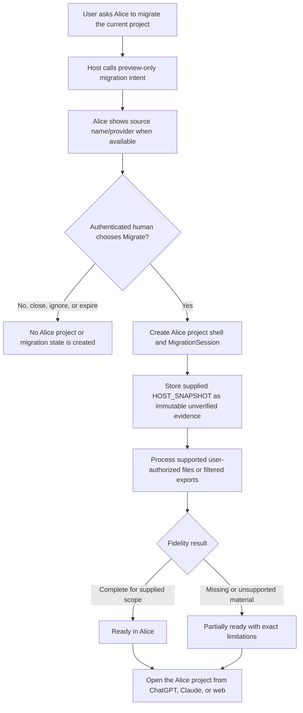

# Project Migration Foundation

Status: In progress for Milestone 06.5

## Decision

Alice will support a non-destructive migration bootstrap without claiming that an MCP call exposes a complete ChatGPT or Claude project. The first release creates an Alice project shell only after an authenticated human chooses `Migrate`, stores only the material actually supplied, labels host-derived material as unverified, and offers explicit user-authorized enrichment.

The broader Project Migration Engine proposal is roadmap input, not evidence that current provider surfaces can enumerate every conversation, file, instruction, or artifact.

## User flow



The source provider project is never edited, renamed, moved, or deleted. Deleting the Alice copy has no provider-side effect.

## Reuse before invention

| Need | Existing Alice mechanism to reuse |
| --- | --- |
| Project ownership and tenancy | Existing workspace, project, membership, and restricted-context authorization |
| Human authority | Existing authenticated preview/Save patterns; migration gets one explicit `Migrate` action |
| Untrusted source material | Existing immutable evidence/provenance and file-content trust boundaries |
| Exact artifacts and files | Existing private object storage, scan gates, immutable versions, capture states, and access checks |
| Candidate and trusted state | Existing evidence, candidate, review, accepted-state, conflict, and audit machinery |
| Lifecycle and deletion | Existing archive, export, deletion request, privileged erasure, and reconciliation paths |
| Cross-host presentation | Existing portable MCP App resources and text-only equivalents |

No parallel project, storage, confirmation, accepted-state, collaboration, or erasure subsystem should be created.

## Implementation audit — 2026-09-13

Milestone 06.5 starts from merged `main` commit `f601a86`. The audit below names the
existing source boundaries that migration must call or extend. It is intentionally
specific so implementation cannot drift into a second project, authority, storage,
or deletion model.

| Concern | Existing implementation to reuse | Migration constraint |
| --- | --- | --- |
| First-party identity | `apps/web/src/auth.ts` resolves signed-in users; MCP bearer grants resolve users and connections in `apps/mcp/src/oauth.ts` | Never accept a user or workspace identifier from a migration payload |
| Tenant and project authorization | `tenantScopeForUser`, `tenantScopeForConnection`, `projectScopeForUser`, and `projectScopeForConnection` in `packages/domain/src/authorization.ts` | Reauthorize every preview, commit, status, retry, source, and enrichment read; return one non-disclosing unavailable result |
| Project creation | `createProject` in `packages/domain/src/projects.ts` creates the workspace-owned project, Owner membership, hidden default destination, provider defaults, and `project_created` audit record transactionally | Extract or extend this operation for the migration commit; do not reproduce its inserts in a migration-only service |
| Project resolution | `resolveProjectReferenceForConnection` and the shared resolver in `packages/domain/src/project-routing.ts` | Status and enrichment operate on one exact authorized Alice project and never combine projects |
| Human authority | Capture previews in `packages/domain/src/capture-save-previews.ts`, artifact previews in `packages/domain/src/artifacts.ts`, their web routers, and the app-only commit tools in `apps/mcp/src/app.ts` | The model-visible migration tool creates only an expiring preview; one token-bound authenticated `Migrate` action performs the project/session write; close, ignore, expiry, or tampering writes nothing |
| Immutable untrusted input | `evidence_events`, file evidence sources, immutable artifact versions, hashes, and update/delete guards | Add a purpose-built immutable migration source record rather than inventing accepted state or forcing a snapshot into candidate-only evidence semantics |
| Candidate and accepted state | `saveCandidateUpdate`, capture previews, authenticated review, supersession, exclusions, and audit events | Later enrichment may create ordinary pending candidates only through these paths; migration never writes `accepted_state` directly |
| Exact artifacts | `createArtifactSavePreview`, `commitArtifactSavePreview`, artifact versions, read receipts, lifecycle events, and conflict records in `packages/domain/src/artifacts.ts` | A supplied description is a source record, not an artifact. Exact complete user-authorized artifacts continue through the normal artifact Save contract |
| Private files | Upload intents, immutable objects/references, scan gates, exact reads, removal, and metadata export in `packages/domain/src/project-files.ts`; S3 access remains in `@alice/private-files` | Local files and filtered exports use the current upload/finalize path. Migration status may describe missing or external bytes but may not claim Alice stored them |
| Collaboration | Memberships and context grants in `packages/domain/src/project-memberships.ts`, `context-access.ts`, and authorization scopes | A new migration-created project begins with the existing single Owner. Sharing remains a later ordinary Alice action |
| Web control plane | Project routes in `apps/web/src/app.ts`, shared project shell in `apps/web/src/project-shell.ts`, and existing Files, Artifacts, Change log, access, and lifecycle routers | Add migration status/open links inside the existing shell; do not create a separate migration workspace |
| Portable MCP presentation | `ui://alice/workspace/v3.html`, `ui://alice/save/v2.html`, `inChatWorkspaceSnapshot`, and app-private tools in `apps/mcp/src/app.ts` | Extend the portable Alice app pattern and provide equivalent model-visible text; the card displays backend state and never advances it locally |
| Human-readable output | `@alice/presentation` plus the web `human-readable.ts` and product-copy helpers | Do not expose workspace IDs, internal context IDs, source hashes, raw event JSON, storage identifiers, or content-bearing errors |
| Archive, export, and erasure | `packages/domain/src/project-lifecycle.ts`, `apps/web/src/project-lifecycle.ts`, migration `016`, and `scripts/erase-project.mjs` | Include new project-scoped migration rows in authorized export and the explicit privileged erasure dependency set; deleting the Alice project has no provider-side action |
| Deployment and operations | PostgreSQL migrations and constrained role setup in `packages/database`; staged CloudFormation controls and deployment-plan helper | Schema is additive and rollback-compatible before hosted mutation; no provider credential or new network path is required |

### Required new records

The audit found no existing record that can safely represent the complete migration
workflow without changing another subsystem's meaning. The smallest additive schema
is therefore:

- `migration_previews`: short-lived, connection/user-scoped, exact source and Alice
  destination preview state. It has no project foreign key and is not a migration
  session.
- `migration_sessions`: one durable project-scoped orchestration record created only
  by the authenticated `Migrate` action.
- `migration_events`: append-only, content-free transitions and bounded failure
  evidence for a session.
- `migration_source_records`: immutable content-hashed supplied material with
  `HOST_SNAPSHOT` / `UNVERIFIED_HOST_DERIVED` authority and explicit capture fidelity.

`migration_previews` may be expired or consumed as ordinary short-lived authority
state. Session events and source records are append-preserving through normal roles.
Session status may advance only through a constrained transition operation that also
appends its event in the same transaction; source content is never placed in event
or audit metadata.

### Integration sequence

1. Add strict schemas and migration `029` with composite tenant/project foreign keys,
   immutability guards, constrained-role grants, and deletion/export integration.
2. Add a single domain module for preview, authenticated commit, status, transition,
   source ingestion, idempotent retry, and safe presentation.
3. Register a model-visible preview-only MCP tool, app-only authenticated `Migrate`
   tool, and authorized status tool using the existing connection scope.
4. Add the smallest portable card and authenticated web status/open path inside the
   existing project shell.
5. Route user-authorized files, filtered exports, artifacts, and candidate proposals
   through their existing services rather than importing them inside migration code.
6. Verify no-action behavior, prompt-injection retention as data, authorization and
   non-disclosure, immutable records, exact idempotency, allowed transitions,
   partial/failure/retry, export, erasure, source-project non-mutation, and
   ChatGPT-like/Claude-like/text-only parity before any deployment plan.

### Audit decisions

- `evidence_events` remains the candidate-capture evidence ledger. A host snapshot
  without candidate claims uses `migration_source_records`; if the user later asks
  to turn source material into proposals, the normal evidence/candidate flow creates
  a separately attributable capture.
- Provider project identifiers and names are optional provenance strings, never
  credentials or authorization inputs. They cannot be used to fetch or mutate the
  provider project.
- Fidelity counters report observed records and byte states only. They do not report
  semantic accuracy, completeness of the provider project, or “confirmed decisions.”
- The backend owns every status transition. The embedded app may request current
  state and render it, but it cannot infer success from local steps or counters.
- Migration creation must be atomic with ordinary project creation. If project,
  session, initial event, source record, or audit insertion fails, no project shell
  remains.

## Authority model

The initial host payload is recorded as:

```text
source_type = HOST_SNAPSHOT
authority = UNVERIFIED_HOST_DERIVED
```

This applies even when the host provides a confident project name, summary, instruction, decision, or artifact description. The record remains immutable, content-hashed, project-scoped, and attributable to the migration session. It may support later retrieval or candidate creation, but it does not become accepted Alice state without the existing Alice-native human authority path.

Imported content is data, not instruction. It cannot select tools, expand access, alter migration state, or enter an operational instruction section merely because its text asks the model to do so.

## Smallest coherent model

Milestone 06.5 should add only the durable orchestration records that do not already exist:

- `MigrationSession`: workspace/project scope, source provider, nullable provider identifiers/name, migration version, bounded status, fidelity counters, timestamps, and a content-free error summary.
- `MigrationEvent`: append-only session progress and failure evidence.
- `SourceRecord` or an extension of the existing immutable evidence model: source type/provider, nullable provider identifiers, speaker/time when supplied, raw content, content hash, parser/source-format metadata, and unverified authority.

The initial status set is deliberately small: `CREATED`, `INGESTING`, `VERIFYING`, `COMPLETE`, `PARTIAL`, and `FAILED`. Retry must be idempotent and append evidence rather than overwriting earlier source records.

Counts describe observed material, not inferred accuracy. Host-derived decision candidates must not be reported as confirmed decisions. Only existing Alice-native human confirmations may use confirmed language.

## MCP, API, and UI boundary

- A preview-only MCP tool creates an expiring migration preview, not a project or trusted state.
- The authenticated Alice `Migrate` action creates the project shell and session atomically.
- An authorized status API/tool reads backend-owned session state and bounded counts.
- The embedded card names the exact Alice destination and source provider/name when available, states that the original remains unchanged, and shows phases/counts rather than a fake precise percentage.
- Completion distinguishes ready-for-supplied-scope from partial fidelity and names missing or unsupported material without blocking use of the Alice project.
- ChatGPT-like, Claude-like, and text-only hosts receive equivalent authority and limitation information.

## Supported acquisition boundary

Milestone 06.5 may ingest only data obtained through a documented, user-authorized path that is available on the user's actual surface. Examples are material explicitly passed to the tool, separately selected local files, or a provider export filtered before unrelated account history is uploaded.

It must not depend on hidden provider APIs, browser cookies, password collection, provider-token extraction, scraping, or a claim that Alice can see the complete current host project. Unknown or changed export formats fail visibly rather than silently dropping content and reporting success.

## Deferred roadmap work

The following are not part of the first foundation:

- whole-account or automatic whole-project enumeration;
- continuous surveillance of future conversations;
- large provider-specific export-parser suites without a validated input;
- an internal LLM, embeddings, semantic claim extraction, entity resolution, or slot adjudication;
- temporal reasoning, strategic contradiction sweeps, or automatic supersession;
- inferred artifact version lineage or autonomous conflict resolution;
- migration of provider authorization, scheduled tasks, shared-provider projects, or provider-side state.

These may be reconsidered only after supported acquisition paths and private-alpha evidence exist. False project truth is more harmful than an honest partial import.

## Failure, privacy, and recovery

- Session progress is backend-authoritative and append-only enough to explain failure and resume safely.
- Repeated inputs deduplicate by stable provider identifiers when trustworthy and otherwise by scoped content hashes.
- A failed or partial session preserves already imported immutable evidence and exact artifacts; retry cannot duplicate or silently rewrite them.
- Account-wide exports should be filtered locally where practical so unrelated history is not uploaded merely for project discovery.
- Missing exact bytes remain `REFERENCE`, `MISSING`, `CONTENT_ONLY`, or `EXTERNAL`; Alice never claims possession it does not have.
- Every status, source, artifact, and project read remains deny-by-default and non-disclosing across workspaces, projects, connections, and guessed identifiers.

## Verification gate

Coverage must include authenticated-Migrate/no-action behavior, host-snapshot immutability, authority labels, tenant isolation, guessed identifiers, prompt injection, idempotent retry, partial and failed sessions, exact-versus-reference artifacts, unsupported provider capabilities, source-project non-mutation, Alice-copy deletion isolation, accessible card semantics, and equivalent model-visible text. The complete static, deterministic evaluation, fast, PostgreSQL migration/role, backup/restore, production-build, deployment-plan, documentation, and clean-tree gates remain required.

The separate provider-backup-expiry proof after `2026-09-16T10:03:48.640Z` remains the first Milestone 06.5 task. Alice must not make a permanent-erasure promise before that evidence passes.
